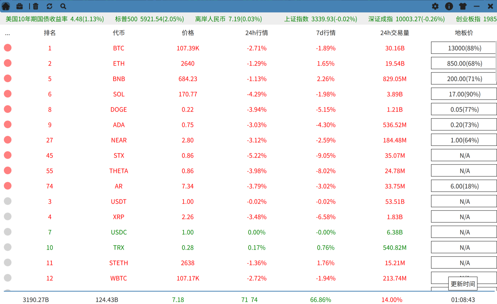

[中文文档](./README.zh-CN.md)

### Features
- [x] Cryptocurrency market data
- [x] Personal toolbox
- [x] Bottom status bar displaying cryptocurrency-related indices and information

### Compilation Environment
- Linux
- Qt5.15
- Rust

### Compilation && Running
- make
- make debug

### Reference
- [Writing a QML Application in Rust](https://dev.to/ayush1325/writing-a-qml-application-in-rust-part-1-3pgi)
- [qmetaobject-rs](https://github.com/woboq/qmetaobject-rs)
